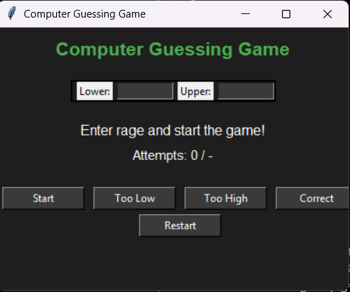

# 🧠 Computer Guessing Game (Binary Search GUI)

## 📸 Screenshot




A Python Tkinter-based GUI game where the computer tries to guess
the number the user has in mind using a **binary search algorithm**.

## 📸 Screenshot


## 🚀 Features
- Binary search based guessing logic
- Real-time attempt counter
- Maximum attempt limit calculation
- Inconsistent answer (lie) detection
- Restart game functionality
- Dark mode UI
- User-friendly graphical interface

## 🖥️ Technologies Used
- Python 3
- Tkinter (GUI)
- Math module

## 🎯 How It Works
1. User enters a lower and upper bound.
2. Computer makes a guess using binary search.
3. User provides feedback:
   - Too Low
   - Too High
   - Correct
4. The game continues until:
   - The computer guesses correctly
   - The user gives inconsistent answers

## ▶️ Run the Project

```bash
python main.py
